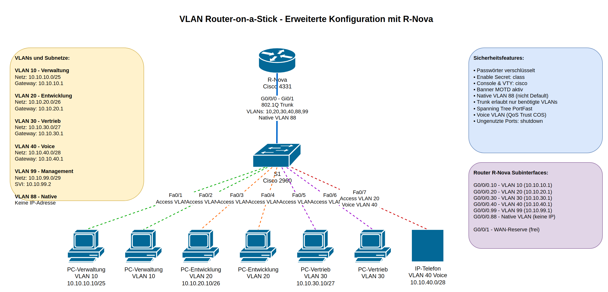

# VLAN Router-on-a-Stick - Erweiterte Konfiguration

## Lernsituation

### Ausgangssituation
Die Nova GmbH plant eine umfassende Netzwerk-Segmentierung mit erweiterten Sicherheitsfeatures. Das Unternehmen verfügt über verschiedene Abteilungen mit unterschiedlichen Sicherheitsanforderungen:

- **Verwaltung (VLAN 10)**: IT-Administration und Netzwerk-Management - höchste Sicherheitsstufe
- **Entwicklung (VLAN 20)**: Software-Entwicklung und Testing - mittlere Sicherheitsstufe  
- **Vertrieb (VLAN 30)**: Sales und Customer Relations - mittlere Sicherheitsstufe
- **Voice (VLAN 40)**: IP-Telefonie mit QoS-Anforderungen
- **Management (VLAN 99)**: Dediziertes Switch-Management VLAN
- **Native VLAN (88)**: Separates Native VLAN für erhöhte Sicherheit

Die Implementierung soll Best Practices für Netzwerksicherheit berücksichtigen, einschließlich verschlüsselter Passwörter, separatem Native VLAN, und Voice VLAN-Konfiguration.

### Lernziele
Nach Abschluss dieser Übung können Sie:
- Erweiterte VLAN-Konfigurationen mit unterschiedlichen Subnetzgrößen implementieren
- Sicherheits-Best-Practices wie separate Native VLANs konfigurieren
- Voice VLANs mit QoS (Quality of Service) einrichten
- Management VLANs (SVI) für Switch-Administration konfigurieren
- Passwort-Verschlüsselung und Banner implementieren
- Router-on-a-Stick mit mehreren Subinterfaces konfigurieren
- Trunk-Konfigurationen mit allowed VLANs optimieren
- Spanning Tree PortFast für Access-Ports aktivieren
- Netzwerk-Sicherheit durch Port-Deaktivierung erhöhen

## Topologie



### Netzwerkgeräte
- **1x Router**: Cisco 4331 (R-Nova)
- **1x Switch**: Cisco 2960 (S1)
- **6x PCs**: Endgeräte in VLANs 10, 20, 30
- **1x IP-Telefon**: Voice VLAN 40

## VLAN- und IP-Adressplan

| VLAN | Name | Zweck | Netz | Maske | Gateway (Router) | Hosts |
|------|------|-------|------|-------|------------------|-------|
| 10 | Verwaltung | IT/Netz-Admin | 10.10.10.0/25 | 255.255.255.128 | 10.10.10.1 | 126 |
| 20 | Entwicklung | Software-Dev | 10.10.20.0/26 | 255.255.255.192 | 10.10.20.1 | 62 |
| 30 | Vertrieb | Sales/CRM | 10.10.30.0/27 | 255.255.255.224 | 10.10.30.1 | 30 |
| 40 | Voice | IP-Telefonie | 10.10.40.0/28 | 255.255.255.240 | 10.10.40.1 | 14 |
| 99 | Management | Switch-Mgmt | 10.10.99.0/29 | 255.255.255.248 | 10.10.99.1 | 6 |
| 88 | Native | Trunk Native | - | - | - | - |

### Sicherheitsfeatures
- ✅ **Passwort-Verschlüsselung**: `service password-encryption`
- ✅ **Enable Secret**: verschlüsselt mit MD5
- ✅ **Banner MOTD**: Warnhinweis für unbefugten Zugriff
- ✅ **Separates Native VLAN**: VLAN 88 (nicht Default VLAN 1)
- ✅ **Allowed VLANs**: Trunk erlaubt nur benötigte VLANs
- ✅ **Voice VLAN**: QoS Trust COS für IP-Telefone
- ✅ **Spanning Tree PortFast**: Schnellere Konvergenz für Access-Ports
- ✅ **Ungenutzte Ports**: Deaktiviert mit `shutdown`

### Netzwerkarchitektur

**Physische Verbindungen:**
- R-Nova G0/0/0 ↔ S1 Gi0/1 (802.1Q Trunk)
- S1 Fa0/1-2 → PC-Verwaltung (Access VLAN 10)
- S1 Fa0/3-4 → PC-Entwicklung (Access VLAN 20)
- S1 Fa0/5-6 → PC-Vertrieb (Access VLAN 30)
- S1 Fa0/7 → IP-Telefon (Access VLAN 20 + Voice VLAN 40)

**Router-Subinterfaces:**
- G0/0/0.10 → VLAN 10 (10.10.10.1/25)
- G0/0/0.20 → VLAN 20 (10.10.20.1/26)
- G0/0/0.30 → VLAN 30 (10.10.30.1/27)
- G0/0/0.40 → VLAN 40 (10.10.40.1/28)
- G0/0/0.99 → VLAN 99 (10.10.99.1/29)
- G0/0/0.88 → Native VLAN (keine IP)

## Arbeitsauftrag

### Aufgabe 1: Basis-Konfiguration und Verkabelung

#### 1.1 Verkabelung vorbereiten
Verkabeln Sie die Geräte gemäß der Topologie:
- R-Nova G0/0/0 ↔ S1 Gi0/1 (Copper Straight-Through)
- Verbinden Sie die PCs und das IP-Telefon mit den entsprechenden Switch-Ports

### Aufgabe 2: Router-Konfiguration (R-Nova)

#### 2.1 Basis-Sicherheitskonfiguration

```cisco
enable
configure terminal
hostname R-Nova
no ip domain-lookup

! Passwort-Sicherheit
enable secret class
line console 0
 password cisco
 login
line vty 0 4
 password cisco
 login
service password-encryption

! Banner Message of the Day
banner motd $ Authorized Users Only! $
```

#### 2.2 Router-on-a-Stick mit Subinterfaces

```cisco
! Physisches Interface aktivieren (wichtig!)
interface GigabitEthernet0/0/0
 no shutdown

! VLAN 10 - Verwaltung
interface GigabitEthernet0/0/0.10
 description VLAN10 Verwaltung
 encapsulation dot1Q 10
 ip address 10.10.10.1 255.255.255.128

! VLAN 20 - Entwicklung
interface GigabitEthernet0/0/0.20
 description VLAN20 Entwicklung
 encapsulation dot1Q 20
 ip address 10.10.20.1 255.255.255.192

! VLAN 30 - Vertrieb
interface GigabitEthernet0/0/0.30
 description VLAN30 Vertrieb
 encapsulation dot1Q 30
 ip address 10.10.30.1 255.255.255.224

! VLAN 40 - Voice
interface GigabitEthernet0/0/0.40
 description VLAN40 Voice
 encapsulation dot1Q 40
 ip address 10.10.40.1 255.255.255.240

! VLAN 99 - Management
interface GigabitEthernet0/0/0.99
 description VLAN99 Management
 encapsulation dot1Q 99
 ip address 10.10.99.1 255.255.255.248

! Native VLAN 88 (keine IP-Adresse!)
interface GigabitEthernet0/0/0.88
 description Native VLAN
 encapsulation dot1Q 88 native
 ! keine IP auf Native VLAN

! G0/0/1 für WAN-Reserve (optional)
interface GigabitEthernet0/0/1
 no shutdown

end
write memory
show ip interface brief
```

**Wichtige Hinweise:**
- Das physische Interface G0/0/0 muss mit `no shutdown` aktiviert werden
- Native VLAN erhält keine IP-Adresse
- Jedes Subinterface benötigt die `encapsulation dot1Q` Anweisung

### Aufgabe 3: Switch-Konfiguration (S1)

#### 3.1 Basis-Sicherheitskonfiguration

```cisco
enable
configure terminal
hostname S1
no ip domain-lookup

! Passwort-Sicherheit
enable secret class
line console 0
 password cisco
 login
line vty 0 15
 password cisco
 login
service password-encryption

! Banner Message of the Day
banner motd $ Authorized Users Only! $
```

#### 3.2 VLAN-Erstellung

```cisco
! VLANs anlegen und benennen
vlan 10
 name Verwaltung
vlan 20
 name Entwicklung
vlan 30
 name Vertrieb
vlan 40
 name Voice
vlan 88
 name Native
vlan 99
 name Management
```

#### 3.3 Access-Ports konfigurieren

```cisco
! VLAN 10 - Verwaltung (Ports Fa0/1-2)
interface range FastEthernet0/1 - 2
 switchport mode access
 switchport access vlan 10
 spanning-tree portfast
 description PC-Verwaltung

! VLAN 20 - Entwicklung (Ports Fa0/3-4)
interface range FastEthernet0/3 - 4
 switchport mode access
 switchport access vlan 20
 spanning-tree portfast
 description PC-Entwicklung

! VLAN 30 - Vertrieb (Ports Fa0/5-6)
interface range FastEthernet0/5 - 6
 switchport mode access
 switchport access vlan 30
 spanning-tree portfast
 description PC-Vertrieb

! VLAN 20 + Voice VLAN 40 (Port Fa0/7 für IP-Telefon)
interface FastEthernet0/7
 switchport mode access
 switchport access vlan 20
 mls qos trust cos
 switchport voice vlan 40
 spanning-tree portfast
 description IP-Phone mit Voice VLAN
```

**Erklärung Voice VLAN:**
- `switchport access vlan 20`: Datennetzwerk für PC hinter Telefon
- `switchport voice vlan 40`: Separates VLAN für Sprachverkehr
- `mls qos trust cos`: QoS aktivieren, COS-Werte vom Telefon vertrauen

#### 3.4 Trunk-Port zum Router

```cisco
! Trunk zu R-Nova
interface GigabitEthernet0/1
 description Trunk zu R-Nova G0/0/0
 switchport mode trunk
 switchport trunk native vlan 88
 switchport trunk allowed vlan 10,20,30,40,88,99
 no shutdown
```

**Best Practices Trunk:**
- Explizit `switchport mode trunk` setzen (DTP vermeiden)
- Native VLAN ändern (nicht Default VLAN 1)
- Nur benötigte VLANs erlauben (`allowed vlan`)

#### 3.5 Management VLAN (SVI)

```cisco
! Switch Virtual Interface für Management
interface vlan 99
 description Mgmt-SVI
 ip address 10.10.99.2 255.255.255.248
 no shutdown
exit

! Default Gateway für Switch
ip default-gateway 10.10.99.1
```

#### 3.6 Ungenutzte Ports sichern

```cisco
! Ungenutzte Ports deaktivieren (Beispiel: Fa0/8-24, Gi0/2)
interface range FastEthernet0/8 - 24
 switchport mode access
 switchport access vlan 30
 shutdown
 description Unused - Security

interface GigabitEthernet0/2
 switchport mode access
 switchport access vlan 30
 shutdown
 description Unused - Security

end
write memory
```

### Aufgabe 4: Endgeräte-Konfiguration

#### 4.1 IP-Konfiguration der PCs

Konfigurieren Sie die PCs mit folgenden IP-Adressen (statisch):

**VLAN 10 - Verwaltung:**
- PC-Verwaltung: `10.10.10.10 / 255.255.255.128`, Gateway: `10.10.10.1`

**VLAN 20 - Entwicklung:**
- PC-Entwicklung: `10.10.20.10 / 255.255.255.192`, Gateway: `10.10.20.1`

**VLAN 30 - Vertrieb:**
- PC-Vertrieb: `10.10.30.10 / 255.255.255.224`, Gateway: `10.10.30.1`

**VLAN 40 - Voice (IP-Telefon):**
- Optional: Statisch oder DHCP im Bereich `10.10.40.0/28`

**Switch Management (SVI):**
- Bereits konfiguriert: `10.10.99.2/29`, Gateway: `10.10.99.1`

## Verifikation und Tests

### Test 1: VLAN-Konfiguration prüfen

```cisco
! Auf S1
S1# show vlan brief
S1# show interfaces trunk
```

**Erwartetes Ergebnis:**
- Alle VLANs (10, 20, 30, 40, 88, 99) sichtbar
- Ports korrekt zugewiesen
- Trunk Gi0/1 aktiv mit Native VLAN 88

### Test 2: Router-Subinterfaces prüfen

```cisco
! Auf R-Nova
R-Nova# show ip interface brief
R-Nova# show interfaces GigabitEthernet0/0/0
R-Nova# show vlans
```

**Erwartetes Ergebnis:**
- Alle Subinterfaces `.10, .20, .30, .40, .88, .99` sind "up/up"
- IP-Adressen korrekt konfiguriert

### Test 3: Intra-VLAN Konnektivität

Von einem PC im VLAN 10:
```
ping 10.10.10.1    (Gateway - sollte erfolgreich sein)
```

Von einem PC im VLAN 20:
```
ping 10.10.20.1    (Gateway - sollte erfolgreich sein)
```

### Test 4: Inter-VLAN Routing

Von PC-Verwaltung (VLAN 10):
```
ping 10.10.20.10   (PC in VLAN 20 - sollte erfolgreich sein)
ping 10.10.30.10   (PC in VLAN 30 - sollte erfolgreich sein)
```

Von PC-Entwicklung (VLAN 20):
```
ping 10.10.10.10   (PC in VLAN 10 - sollte erfolgreich sein)
ping 10.10.30.10   (PC in VLAN 30 - sollte erfolgreich sein)
```

### Test 5: Switch-Management-Zugriff

Von einem beliebigen PC:
```
ping 10.10.99.2    (Switch SVI - sollte erfolgreich sein)
```

Von R-Nova:
```
telnet 10.10.99.2  (Telnet zu S1 - mit Passwort "cisco" einloggen)
```

### Test 6: Voice VLAN Funktionalität

Prüfen Sie auf S1:
```cisco
S1# show interfaces FastEthernet0/7 switchport
```

**Erwartetes Ergebnis:**
- Access VLAN: 20
- Voice VLAN: 40
- Administrative Mode: static access

## Troubleshooting

### Problem 1: Keine Kommunikation zwischen VLANs

**Symptome:** PCs in verschiedenen VLANs können nicht kommunizieren

**Mögliche Ursachen und Lösungen:**
1. **Router-Interface nicht aktiviert**
   ```cisco
   interface GigabitEthernet0/0/0
    no shutdown
   ```

2. **Falsche Subinterface-Konfiguration**
   - Prüfen: VLAN-ID in `encapsulation dot1Q` stimmt überein
   - Prüfen: IP-Adresse und Maske korrekt

3. **Default Gateway am PC falsch**
   - Muss auf Router-Subinterface-IP zeigen

### Problem 2: Native VLAN Mismatch

**Symptome:** CDP-Warnungen, intermittierende Verbindungsprobleme

**Lösung:**
```cisco
! Auf beiden Seiten (Router und Switch) muss Native VLAN übereinstimmen
! Switch:
interface GigabitEthernet0/1
 switchport trunk native vlan 88

! Router:
interface GigabitEthernet0/0/0.88
 encapsulation dot1Q 88 native
```

### Problem 3: Trunk erlaubt VLAN nicht

**Symptome:** VLAN funktioniert nicht über Trunk

**Lösung:**
```cisco
interface GigabitEthernet0/1
 switchport trunk allowed vlan 10,20,30,40,88,99
```

Alternativ alle VLANs erlauben (nicht empfohlen):
```cisco
 switchport trunk allowed vlan all
```

### Problem 4: Voice VLAN funktioniert nicht

**Symptome:** IP-Telefon erhält keine IP oder kann nicht telefonieren

**Lösung:**
```cisco
interface FastEthernet0/7
 switchport mode access
 switchport access vlan 20
 switchport voice vlan 40
 mls qos trust cos
 spanning-tree portfast
```

Prüfen Sie:
- Voice VLAN ist auf Switch erstellt
- Voice VLAN ist im Trunk allowed
- Router hat Subinterface für Voice VLAN

### Problem 5: Switch-Management nicht erreichbar

**Symptome:** Kann nicht zu Switch SVI pingen oder telnet

**Lösung:**
```cisco
! SVI muss "no shutdown" haben
interface vlan 99
 ip address 10.10.99.2 255.255.255.248
 no shutdown
exit

! Default Gateway muss gesetzt sein
ip default-gateway 10.10.99.1

! VLAN 99 muss im Trunk erlaubt sein
interface GigabitEthernet0/1
 switchport trunk allowed vlan add 99
```

## Typische Stolperfallen

1. ❌ **Native VLAN Mismatch** zwischen Router und Switch
   - ✅ Lösung: VLAN 88 auf beiden Seiten als Native konfigurieren

2. ❌ **Physisches Interface nicht aktiviert** (Router G0/0/0)
   - ✅ Lösung: `no shutdown` auf G0/0/0 nicht vergessen

3. ❌ **Subinterface ohne `encapsulation dot1Q`**
   - ✅ Lösung: Jedes Subinterface benötigt diese Anweisung

4. ❌ **Default Gateway am PC falsch oder fehlt**
   - ✅ Lösung: Gateway muss Router-Subinterface-IP sein

5. ❌ **VLAN existiert nicht auf Switch**
   - ✅ Lösung: VLANs müssen explizit mit `vlan X` erstellt werden

6. ❌ **VLAN nicht im Trunk allowed**
   - ✅ Lösung: `switchport trunk allowed vlan` Liste prüfen

7. ❌ **PortFast auf Trunk-Port aktiviert**
   - ✅ Lösung: PortFast nur auf Access-Ports verwenden

8. ❌ **Voice VLAN ohne QoS Trust**
   - ✅ Lösung: `mls qos trust cos` auf Voice-Port setzen

## Erweiterte Konfigurationsoptionen

### Option A: DTP (Dynamic Trunking Protocol) deaktivieren

Für erhöhte Sicherheit DTP explizit deaktivieren:

```cisco
interface GigabitEthernet0/1
 switchport mode trunk
 switchport nonegotiate
```

### Option B: Port Security aktivieren

Access-Ports gegen MAC-Flooding schützen:

```cisco
interface range FastEthernet0/1 - 6
 switchport port-security
 switchport port-security maximum 2
 switchport port-security violation restrict
 switchport port-security mac-address sticky
```

### Option C: VTP (VLAN Trunking Protocol) Mode

Für Single-Switch-Umgebung VTP transparent schalten:

```cisco
vtp mode transparent
```

### Option D: DHCP für Endgeräte (optional)

Statt statischer IPs DHCP-Pools auf Router konfigurieren:

```cisco
! Auf R-Nova
ip dhcp excluded-address 10.10.10.1 10.10.10.10
ip dhcp pool VLAN10
 network 10.10.10.0 255.255.255.128
 default-router 10.10.10.1
 dns-server 8.8.8.8

ip dhcp excluded-address 10.10.20.1 10.10.20.10
ip dhcp pool VLAN20
 network 10.10.20.0 255.255.255.192
 default-router 10.10.20.1
 dns-server 8.8.8.8
```

## Dokumentationsaufgaben

1. **Netzwerk-Dokumentation erstellen:**
   - Dokumentieren Sie alle IP-Adressen
   - Erstellen Sie eine Port-Zuordnungstabelle
   - Notieren Sie alle Passwörter (in Produktivumgebung verschlüsselt speichern!)

2. **Testergebnisse festhalten:**
   - Screenshot von `show vlan brief`
   - Screenshot von `show interfaces trunk`
   - Screenshot von `show ip interface brief`
   - Ping-Tests dokumentieren

3. **Sicherheits-Begründung schriftlich:**
   - Warum separates Native VLAN?
   - Welche Risiken senkt VLAN-Trennung?
   - Warum eigenes Management-VLAN?
   - Welche Vorteile hat Voice VLAN?

## Zusammenfassung

In dieser Übung haben Sie gelernt:

✅ **Router-on-a-Stick** mit mehreren Subinterfaces zu konfigurieren  
✅ **Erweiterte VLAN-Strukturen** mit unterschiedlichen Subnetzgrößen zu implementieren  
✅ **Sicherheits-Best-Practices** wie separates Native VLAN anzuwenden  
✅ **Voice VLANs** mit QoS-Unterstützung einzurichten  
✅ **Switch-Management** über dediziertes VLAN (SVI) zu realisieren  
✅ **Trunk-Konfigurationen** mit allowed VLANs zu optimieren  
✅ **Passwort-Verschlüsselung** und Banner zu implementieren  
✅ **Systematische Verifikation** und Troubleshooting durchzuführen  

## Nächste Schritte

- **Erweitern Sie die Topologie** mit einem zweiten Switch (Hierarchisches Design)
- **Implementieren Sie ACLs** (Access Control Lists) für erweiterte Sicherheit
- **Konfigurieren Sie DHCP** anstelle statischer IP-Adressen
- **Fügen Sie einen zweiten Router hinzu** für WAN-Connectivity
- **Implementieren Sie Routing-Protokolle** (OSPF, EIGRP)

---

**Viel Erfolg bei der Implementierung! 🚀**
