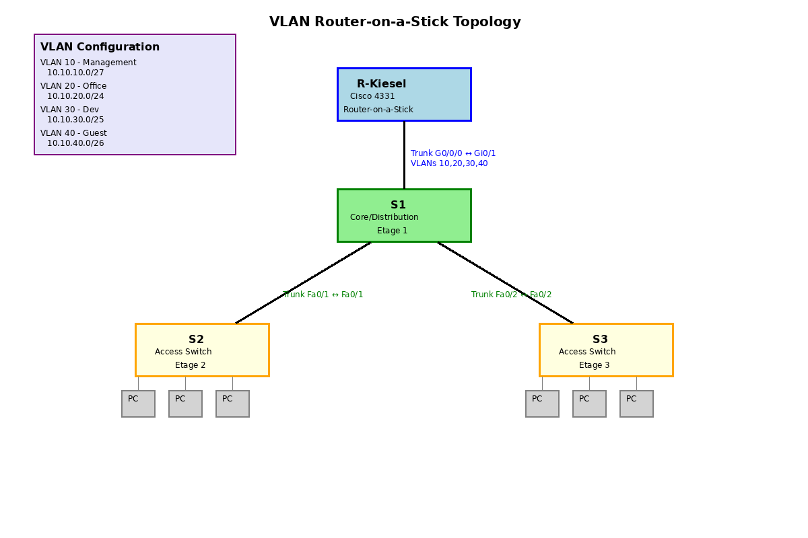

# VLAN Router-on-a-Stick Lab

## Szenario

In diesem Lab konfigurieren Sie ein Netzwerk mit mehreren VLANs und Inter-VLAN Routing über einen Router (Router-on-a-Stick). Das Szenario simuliert eine typische Unternehmensumgebung mit getrennten Netzwerksegmenten für Management, Office, Entwicklung und Gäste.

Das Netzwerk umfasst:
- 1 Router (Cisco 4331) für Inter-VLAN Routing
- 1 Core/Distribution Switch (S1)
- 2 Access Switches (S2, S3)
- 4 VLANs mit unterschiedlichen Subnetzgrößen

## Zielsetzung

Am Ende dieses Labs können Sie:
- VLANs auf Cisco Switches erstellen und konfigurieren
- Trunk-Ports zwischen Switches konfigurieren
- Router-on-a-Stick für Inter-VLAN Routing einrichten
- Subinterfaces mit 802.1Q Encapsulation konfigurieren
- Access-Ports den entsprechenden VLANs zuweisen
- Konnektivität innerhalb und zwischen VLANs testen

## Topologie



## VLAN- und IP-Adressplan

| VLAN | Name       | Zweck                    | Netzwerk       | Subnetzmaske      | Gateway (Router) |
|------|------------|--------------------------|----------------|-------------------|------------------|
| 10   | Management | IT/Netz-Admin            | 10.10.10.0/27  | 255.255.255.224   | 10.10.10.1       |
| 20   | Office     | Vertrieb/HR/Backoffice   | 10.10.20.0/24  | 255.255.255.0     | 10.10.20.1       |
| 30   | Dev        | Entwicklung/Produktion   | 10.10.30.0/25  | 255.255.255.128   | 10.10.30.1       |
| 40   | Guest      | Gäste/extern             | 10.10.40.0/26  | 255.255.255.192   | 10.10.40.1       |

**Hinweis:** Native VLAN = 1 (Default). Best Practice (separates Native VLAN) kann als Erweiterung umgesetzt werden.

## Logische Topologie

### Router R-Kiesel (Cisco 4331)
- **G0/0/0:** Trunk zu S1 Gi0/1
- **Subinterfaces:**
  - G0/0/0.10: VLAN 10 (10.10.10.1/27)
  - G0/0/0.20: VLAN 20 (10.10.20.1/24)
  - G0/0/0.30: VLAN 30 (10.10.30.1/25)
  - G0/0/0.40: VLAN 40 (10.10.40.1/26)

### Switch S1 (Core/Distribution - Etage 1)
- **Gi0/1:** Trunk zu Router G0/0/0
- **Fa0/1:** Trunk zu S2
- **Fa0/2:** Trunk zu S3
- **Access-Ports:**
  - Fa0/11-12: VLAN 10 (Management)
  - Fa0/13-18: VLAN 40 (Guest)

### Switch S2 (Access - Etage 2)
- **Fa0/1:** Uplink-Trunk zu S1
- **Access-Ports:**
  - Fa0/3-10: VLAN 20 (Office)
  - Fa0/11-16: VLAN 30 (Dev)
  - Fa0/17-20: VLAN 40 (Guest)

### Switch S3 (Access - Etage 3)
- **Fa0/2:** Uplink-Trunk zu S1
- **Access-Ports:**
  - Fa0/3-6: VLAN 10 (Management)
  - Fa0/7-14: VLAN 20 (Office)
  - Fa0/15-18: VLAN 40 (Guest)

## Verkabelung

| Gerät    | Port   | ↔ | Gerät    | Port   | Kabeltyp              |
|----------|--------|---|----------|--------|-----------------------|
| R-Kiesel | G0/0/0 | ↔ | S1       | Gi0/1  | Copper Straight-Through |
| S1       | Fa0/1  | ↔ | S2       | Fa0/1  | Copper Straight-Through |
| S1       | Fa0/2  | ↔ | S3       | Fa0/2  | Copper Straight-Through |

## Aufgaben

### Aufgabe 1: Router R-Kiesel konfigurieren

**Schritt 1.1:** Grundkonfiguration
```
enable
conf t
hostname R-Kiesel
no ip domain-lookup
```

**Schritt 1.2:** Physisches Interface aktivieren
```
interface g0/0/0
 no shutdown
exit
```

**Schritt 1.3:** Subinterface für VLAN 10 (Management) konfigurieren
```
interface g0/0/0.10
 encapsulation dot1Q 10
 ip address 10.10.10.1 255.255.255.224
exit
```

**Schritt 1.4:** Subinterface für VLAN 20 (Office) konfigurieren
```
interface g0/0/0.20
 encapsulation dot1Q 20
 ip address 10.10.20.1 255.255.255.0
exit
```

**Schritt 1.5:** Subinterface für VLAN 30 (Dev) konfigurieren
```
interface g0/0/0.30
 encapsulation dot1Q 30
 ip address 10.10.30.1 255.255.255.128
exit
```

**Schritt 1.6:** Subinterface für VLAN 40 (Guest) konfigurieren
```
interface g0/0/0.40
 encapsulation dot1Q 40
 ip address 10.10.40.1 255.255.255.192
exit
```

**Schritt 1.7:** Konfiguration speichern
```
end
write memory
```

### Aufgabe 2: Switch S1 (Core) konfigurieren

**Schritt 2.1:** Grundkonfiguration
```
enable
conf t
hostname S1
no ip domain-lookup
```

**Schritt 2.2:** VLANs erstellen und benennen
```
vlan 10
 name Management
vlan 20
 name Office
vlan 30
 name Dev
vlan 40
 name Guest
exit
```

**Schritt 2.3:** Trunk zu Router konfigurieren
```
interface gi0/1
 switchport mode trunk
 switchport trunk allowed vlan 10,20,30,40
 no shutdown
exit
```

**Schritt 2.4:** Trunk zu S2 konfigurieren
```
interface fa0/1
 switchport mode trunk
 switchport trunk allowed vlan 10,20,30,40
 no shutdown
exit
```

**Schritt 2.5:** Trunk zu S3 konfigurieren
```
interface fa0/2
 switchport mode trunk
 switchport trunk allowed vlan 10,20,30,40
 no shutdown
exit
```

**Schritt 2.6:** Access-Ports für VLAN 10 (Management) konfigurieren
```
interface range fa0/11-12
 switchport mode access
 switchport access vlan 10
exit
```

**Schritt 2.7:** Access-Ports für VLAN 40 (Guest) konfigurieren
```
interface range fa0/13-18
 switchport mode access
 switchport access vlan 40
exit
```

**Schritt 2.8:** Konfiguration speichern
```
end
write memory
```

### Aufgabe 3: Switch S2 (Access - Etage 2) konfigurieren

**Schritt 3.1:** Grundkonfiguration
```
enable
conf t
hostname S2
no ip domain-lookup
```

**Schritt 3.2:** VLANs erstellen und benennen
```
vlan 10
 name Management
vlan 20
 name Office
vlan 30
 name Dev
vlan 40
 name Guest
exit
```

**Schritt 3.3:** Uplink-Trunk zu S1 konfigurieren
```
interface fa0/1
 switchport mode trunk
 switchport trunk allowed vlan 10,20,30,40
 no shutdown
exit
```

**Schritt 3.4:** Access-Ports für VLAN 20 (Office) konfigurieren
```
interface range fa0/3-10
 switchport mode access
 switchport access vlan 20
exit
```

**Schritt 3.5:** Access-Ports für VLAN 30 (Dev) konfigurieren
```
interface range fa0/11-16
 switchport mode access
 switchport access vlan 30
exit
```

**Schritt 3.6:** Access-Ports für VLAN 40 (Guest) konfigurieren
```
interface range fa0/17-20
 switchport mode access
 switchport access vlan 40
exit
```

**Schritt 3.7:** Konfiguration speichern
```
end
write memory
```

### Aufgabe 4: Switch S3 (Access - Etage 3) konfigurieren

**Schritt 4.1:** Grundkonfiguration
```
enable
conf t
hostname S3
no ip domain-lookup
```

**Schritt 4.2:** VLANs erstellen und benennen
```
vlan 10
 name Management
vlan 20
 name Office
vlan 30
 name Dev
vlan 40
 name Guest
exit
```

**Schritt 4.3:** Uplink-Trunk zu S1 konfigurieren
```
interface fa0/2
 switchport mode trunk
 switchport trunk allowed vlan 10,20,30,40
 no shutdown
exit
```

**Schritt 4.4:** Access-Ports für VLAN 10 (Management) konfigurieren
```
interface range fa0/3-6
 switchport mode access
 switchport access vlan 10
exit
```

**Schritt 4.5:** Access-Ports für VLAN 20 (Office) konfigurieren
```
interface range fa0/7-14
 switchport mode access
 switchport access vlan 20
exit
```

**Schritt 4.6:** Access-Ports für VLAN 40 (Guest) konfigurieren
```
interface range fa0/15-18
 switchport mode access
 switchport access vlan 40
exit
```

**Schritt 4.7:** Konfiguration speichern
```
end
write memory
```

### Aufgabe 5: Endgeräte konfigurieren

Konfigurieren Sie PCs in den verschiedenen VLANs mit den folgenden Parametern:

**VLAN 10 (Management) - Beispiel PC1:**
- IP-Adresse: 10.10.10.2
- Subnetzmaske: 255.255.255.224
- Default Gateway: 10.10.10.1

**VLAN 20 (Office) - Beispiel PC2:**
- IP-Adresse: 10.10.20.2
- Subnetzmaske: 255.255.255.0
- Default Gateway: 10.10.20.1

**VLAN 30 (Dev) - Beispiel PC3:**
- IP-Adresse: 10.10.30.2
- Subnetzmaske: 255.255.255.128
- Default Gateway: 10.10.30.1

**VLAN 40 (Guest) - Beispiel PC4:**
- IP-Adresse: 10.10.40.2
- Subnetzmaske: 255.255.255.192
- Default Gateway: 10.10.40.1

## Verifikation

### Test 1: VLAN-Konfiguration überprüfen

Auf jedem Switch:
```
show vlan brief
```

**Erwartetes Ergebnis:** Alle VLANs (10, 20, 30, 40) sollten sichtbar sein mit den korrekten Namen.

### Test 2: Trunk-Konfiguration überprüfen

Auf S1:
```
show interfaces trunk
```

**Erwartetes Ergebnis:** Gi0/1, Fa0/1, und Fa0/2 sollten als Trunk-Ports aufgeführt sein mit VLANs 10,20,30,40.

Auf S2 und S3:
```
show interfaces trunk
```

**Erwartetes Ergebnis:** Der Uplink-Port sollte als Trunk sichtbar sein.

### Test 3: Router Subinterfaces überprüfen

Auf R-Kiesel:
```
show ip interface brief
```

**Erwartetes Ergebnis:** G0/0/0 und alle Subinterfaces (.10, .20, .30, .40) sollten "up/up" sein.

```
show interfaces g0/0/0.10
show interfaces g0/0/0.20
show interfaces g0/0/0.30
show interfaces g0/0/0.40
```

**Erwartetes Ergebnis:** 802.1Q Encapsulation sollte konfiguriert sein mit den korrekten VLAN-IDs.

### Test 4: Konnektivität innerhalb eines VLANs testen

Von einem PC in VLAN 20 (Office):
```
ping 10.10.20.1
```

**Erwartetes Ergebnis:** Ping zum Gateway sollte erfolgreich sein.

Von einem PC in VLAN 20 zu einem anderen PC in VLAN 20:
```
ping [IP-Adresse des anderen PCs]
```

**Erwartetes Ergebnis:** Ping sollte erfolgreich sein.

### Test 5: Inter-VLAN Routing testen

Von einem PC in VLAN 20 (10.10.20.2) zu einem PC in VLAN 30 (10.10.30.2):
```
ping 10.10.30.2
```

**Erwartetes Ergebnis:** Ping sollte erfolgreich sein (Router leitet zwischen VLANs).

Von einem PC in VLAN 10 zu einem PC in VLAN 40:
```
ping [IP in VLAN 40]
```

**Erwartetes Ergebnis:** Ping sollte erfolgreich sein.

### Test 6: Routing-Tabelle überprüfen

Auf R-Kiesel:
```
show ip route
```

**Erwartetes Ergebnis:** Direkt verbundene Routen für alle vier Subnetze sollten sichtbar sein:
- 10.10.10.0/27 via G0/0/0.10
- 10.10.20.0/24 via G0/0/0.20
- 10.10.30.0/25 via G0/0/0.30
- 10.10.40.0/26 via G0/0/0.40

## Troubleshooting

### Problem: Kein Ping innerhalb des VLANs

**Mögliche Ursachen:**
1. VLAN nicht auf dem Switch konfiguriert
2. Port nicht dem korrekten VLAN zugewiesen
3. IP-Konfiguration auf PCs falsch
4. Kabel nicht richtig verbunden

**Diagnose:**
```
show vlan brief
show interfaces [interface-id] switchport
show running-config interface [interface-id]
```

### Problem: Kein Inter-VLAN Routing

**Mögliche Ursachen:**
1. Subinterfaces nicht konfiguriert oder down
2. Falsche Encapsulation auf Subinterfaces
3. Trunk zwischen Router und S1 nicht konfiguriert
4. Falsches Gateway auf PCs konfiguriert

**Diagnose:**
```
! Auf Router:
show ip interface brief
show interfaces g0/0/0.10
show interfaces trunk

! Auf S1:
show interfaces gi0/1 switchport
show interfaces trunk
```

### Problem: Trunk-Verbindung funktioniert nicht

**Mögliche Ursachen:**
1. Trunk-Modus nicht auf beiden Seiten konfiguriert
2. Native VLAN Mismatch
3. Allowed VLANs stimmen nicht überein
4. Physisches Interface down

**Diagnose:**
```
show interfaces trunk
show interfaces [interface-id] switchport
show running-config interface [interface-id]
```

## Erweiterte Aufgaben (Optional)

1. **Separates Native VLAN:** Ändern Sie das Native VLAN auf allen Trunks von VLAN 1 auf ein ungenutztes VLAN (z.B. VLAN 99)

2. **Port Security:** Implementieren Sie Port Security auf Access-Ports, um die Anzahl der MAC-Adressen pro Port zu begrenzen

3. **DHCP:** Konfigurieren Sie DHCP-Pools auf dem Router für jedes VLAN

4. **Access Control Lists (ACLs):** Erstellen Sie ACLs, um den Traffic zwischen bestimmten VLANs zu kontrollieren (z.B. Guest-VLAN darf nicht auf Management-VLAN zugreifen)

5. **VTP (VLAN Trunking Protocol):** Konfigurieren Sie VTP, um VLAN-Informationen automatisch zwischen Switches zu verteilen

6. **Spanning Tree:** Untersuchen Sie die Spanning Tree Topologie mit `show spanning-tree` und optimieren Sie die Root Bridge Wahl

## Zusammenfassung

In diesem Lab haben Sie gelernt:
- VLANs auf Cisco Switches zu erstellen und zu konfigurieren
- Trunk-Verbindungen zwischen Switches und zum Router einzurichten
- Router-on-a-Stick mit 802.1Q Subinterfaces zu konfigurieren
- Inter-VLAN Routing zu implementieren
- Die Konfiguration mit verschiedenen show-Befehlen zu verifizieren
- Typische Probleme zu diagnostizieren und zu beheben

Diese Fähigkeiten sind fundamental für das Design und die Implementierung von segmentierten Netzwerken in Unternehmensumgebungen.

## Referenzen

- Cisco IOS VLAN Configuration Guide
- Cisco Router-on-a-Stick Configuration Guide
- IEEE 802.1Q Standard (VLAN Tagging)
