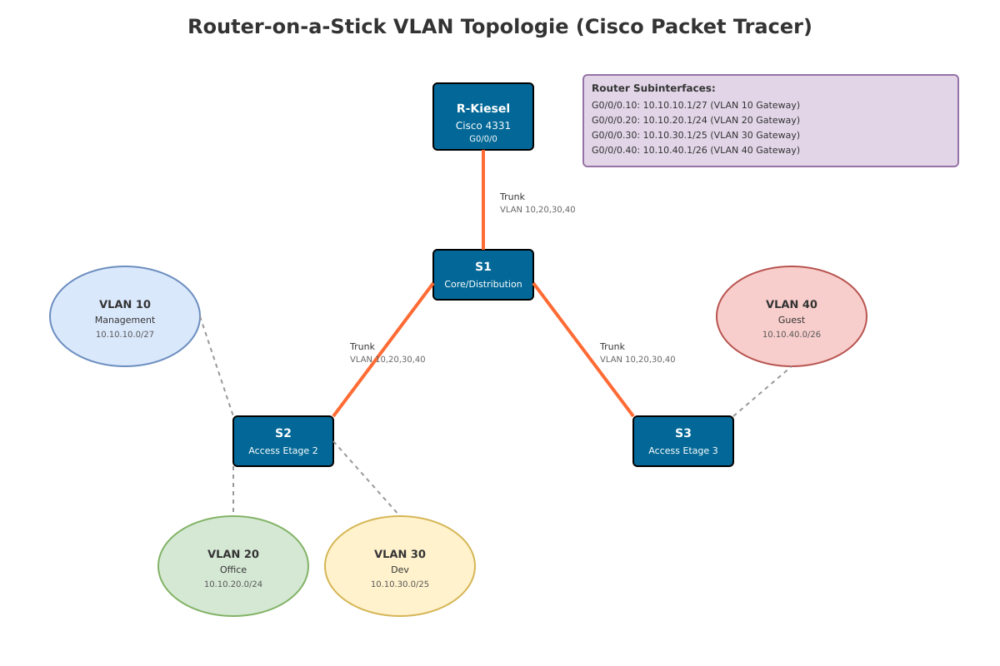

# Router-on-a-Stick VLAN Konfiguration — Cisco Lab

## Szenario

In diesem Lab konfigurieren Sie ein Unternehmensnetzwerk mit mehreren VLANs für verschiedene Abteilungen. Das Netzwerk verwendet die Router-on-a-Stick-Technik, um Inter-VLAN-Routing über einen einzelnen Router-Port zu ermöglichen. 

Die Firma hat folgende Anforderungen:
- **VLAN 10 (Management)**: IT- und Netzwerk-Administratoren (kleine Gruppe)
- **VLAN 20 (Office)**: Vertrieb, HR und Backoffice (größte Gruppe)
- **VLAN 30 (Dev)**: Entwicklung und Produktion (mittlere Gruppe)
- **VLAN 40 (Guest)**: Gäste und externe Mitarbeiter (eingeschränkte Gruppe)

Die Topologie besteht aus einem Core-Switch (S1) in Etage 1, der über Trunk-Verbindungen mit zwei Access-Switches (S2 und S3) in den Etagen 2 und 3 verbunden ist. Ein Cisco 4331 Router ermöglicht das Routing zwischen den VLANs.

## Topologie



**Physische Verbindungen:**
- R-Kiesel G0/0/0 ↔ S1 Gi0/1 (Trunk mit allen VLANs)
- S1 Fa0/1 ↔ S2 Fa0/1 (Trunk)
- S1 Fa0/2 ↔ S3 Fa0/2 (Trunk)

## VLAN- und IP-Adressierungsplan

| VLAN | Name       | Zweck                  | Netzwerk       | Subnetzmaske    | Gateway (Router) | Hosts  |
|------|------------|------------------------|----------------|-----------------|------------------|--------|
| 10   | Management | IT/Netz-Admin          | 10.10.10.0/27  | 255.255.255.224 | 10.10.10.1       | 30     |
| 20   | Office     | Vertrieb/HR/Backoffice | 10.10.20.0/24  | 255.255.255.0   | 10.10.20.1       | 254    |
| 30   | Dev        | Entwicklung/Produktion | 10.10.30.0/25  | 255.255.255.128 | 10.10.30.1       | 126    |
| 40   | Guest      | Gäste/extern           | 10.10.40.0/26  | 255.255.255.192 | 10.10.40.1       | 62     |

**Hinweis:** Das Native VLAN bleibt auf Standard (VLAN 1) für diese Übung. Als Erweiterung kann ein separates Native VLAN konfiguriert werden (Best Practice).

## Port-Zuordnung

### Switch S1 (Core/Distribution - Etage 1)
- **Gi0/1**: Trunk zum Router (VLAN 10,20,30,40)
- **Fa0/1**: Trunk zu S2 (VLAN 10,20,30,40)
- **Fa0/2**: Trunk zu S3 (VLAN 10,20,30,40)
- **Fa0/11-12**: Access VLAN 10 (Management)
- **Fa0/13-18**: Access VLAN 40 (Guest)

### Switch S2 (Access - Etage 2)
- **Fa0/1**: Uplink-Trunk zu S1
- **Fa0/3-10**: Access VLAN 20 (Office)
- **Fa0/11-16**: Access VLAN 30 (Dev)
- **Fa0/17-20**: Access VLAN 40 (Guest)

### Switch S3 (Access - Etage 3)
- **Fa0/2**: Uplink-Trunk zu S1
- **Fa0/3-6**: Access VLAN 10 (Management)
- **Fa0/7-14**: Access VLAN 20 (Office)
- **Fa0/15-18**: Access VLAN 40 (Guest)

## Anforderungen

1. VLANs auf allen Switches anlegen und benennen
2. Trunk-Verbindungen zwischen Switches und Router konfigurieren
3. Access-Ports den entsprechenden VLANs zuordnen
4. Router-on-a-Stick Konfiguration mit Subinterfaces
5. Inter-VLAN Routing ermöglichen
6. Konnektivität testen (innerhalb VLAN und zwischen VLANs)

## Aufgaben

### Aufgabe 1: Router R-Kiesel Konfiguration

**Ziel:** Router mit Subinterfaces für jedes VLAN konfigurieren (Router-on-a-Stick)

**Verkabelung:** R-Kiesel G0/0/0 ↔ S1 Gi0/1 (Copper Straight-Through)

**Konfiguration:**

```cisco
enable
configure terminal
hostname R-Kiesel
no ip domain-lookup

! Hauptinterface aktivieren
interface g0/0/0
 no shutdown

! VLAN 10 Subinterface
interface g0/0/0.10
 encapsulation dot1Q 10
 ip address 10.10.10.1 255.255.255.224
 description Management VLAN Gateway

! VLAN 20 Subinterface
interface g0/0/0.20
 encapsulation dot1Q 20
 ip address 10.10.20.1 255.255.255.0
 description Office VLAN Gateway

! VLAN 30 Subinterface
interface g0/0/0.30
 encapsulation dot1Q 30
 ip address 10.10.30.1 255.255.255.128
 description Dev VLAN Gateway

! VLAN 40 Subinterface
interface g0/0/0.40
 encapsulation dot1Q 40
 ip address 10.10.40.1 255.255.255.192
 description Guest VLAN Gateway

end
write memory
```

### Aufgabe 2: Switch S1 (Core) Konfiguration

**Ziel:** VLANs erstellen und Trunk-Ports konfigurieren

**Verkabelung:**
- S1 Gi0/1 ↔ R-Kiesel G0/0/0 (Trunk)
- S1 Fa0/1 ↔ S2 Fa0/1 (Trunk)
- S1 Fa0/2 ↔ S3 Fa0/2 (Trunk)

**Konfiguration:**

```cisco
enable
configure terminal
hostname S1
no ip domain-lookup

! VLANs anlegen
vlan 10
 name Management
vlan 20
 name Office
vlan 30
 name Dev
vlan 40
 name Guest

! Trunk zum Router
interface gi0/1
 switchport mode trunk
 switchport trunk allowed vlan 10,20,30,40
 description Trunk to R-Kiesel
 no shutdown

! Trunk zu S2
interface fa0/1
 switchport mode trunk
 switchport trunk allowed vlan 10,20,30,40
 description Trunk to S2
 no shutdown

! Trunk zu S3
interface fa0/2
 switchport mode trunk
 switchport trunk allowed vlan 10,20,30,40
 description Trunk to S3
 no shutdown

! Access-Ports Etage 1
interface range fa0/11-12
 switchport mode access
 switchport access vlan 10
 description Management Ports

interface range fa0/13-18
 switchport mode access
 switchport access vlan 40
 description Guest Ports

end
write memory
```

### Aufgabe 3: Switch S2 (Access Etage 2) Konfiguration

**Ziel:** VLANs erstellen und Access-Ports zuweisen

**Verkabelung:** S2 Fa0/1 ↔ S1 Fa0/1

**Konfiguration:**

```cisco
enable
configure terminal
hostname S2
no ip domain-lookup

! VLANs anlegen
vlan 10
 name Management
vlan 20
 name Office
vlan 30
 name Dev
vlan 40
 name Guest

! Uplink-Trunk zu S1
interface fa0/1
 switchport mode trunk
 switchport trunk allowed vlan 10,20,30,40
 description Uplink to S1
 no shutdown

! Access-Ports Etage 2
interface range fa0/3-10
 switchport mode access
 switchport access vlan 20
 description Office Ports

interface range fa0/11-16
 switchport mode access
 switchport access vlan 30
 description Dev Ports

interface range fa0/17-20
 switchport mode access
 switchport access vlan 40
 description Guest Ports

end
write memory
```

### Aufgabe 4: Switch S3 (Access Etage 3) Konfiguration

**Ziel:** VLANs erstellen und Access-Ports zuweisen

**Verkabelung:** S3 Fa0/2 ↔ S1 Fa0/2

**Konfiguration:**

```cisco
enable
configure terminal
hostname S3
no ip domain-lookup

! VLANs anlegen
vlan 10
 name Management
vlan 20
 name Office
vlan 30
 name Dev
vlan 40
 name Guest

! Uplink-Trunk zu S1
interface fa0/2
 switchport mode trunk
 switchport trunk allowed vlan 10,20,30,40
 description Uplink to S1
 no shutdown

! Access-Ports Etage 3
interface range fa0/3-6
 switchport mode access
 switchport access vlan 10
 description Management Ports

interface range fa0/7-14
 switchport mode access
 switchport access vlan 20
 description Office Ports

interface range fa0/15-18
 switchport mode access
 switchport access vlan 40
 description Guest Ports

end
write memory
```

### Aufgabe 5: PC-Konfiguration

**Ziel:** PCs mit passenden IP-Adressen und Gateways konfigurieren

Konfigurieren Sie PCs in den verschiedenen VLANs mit folgenden Parametern:

**VLAN 10 (Management) - Beispiel PC1:**
- IP-Adresse: 10.10.10.10
- Subnetzmaske: 255.255.255.224
- Gateway: 10.10.10.1

**VLAN 20 (Office) - Beispiel PC2:**
- IP-Adresse: 10.10.20.10
- Subnetzmaske: 255.255.255.0
- Gateway: 10.10.20.1

**VLAN 30 (Dev) - Beispiel PC3:**
- IP-Adresse: 10.10.30.10
- Subnetzmaske: 255.255.255.128
- Gateway: 10.10.30.1

**VLAN 40 (Guest) - Beispiel PC4:**
- IP-Adresse: 10.10.40.10
- Subnetzmaske: 255.255.255.192
- Gateway: 10.10.40.1

## Verifikation

### Auf dem Router

**Subinterfaces überprüfen:**
```cisco
R-Kiesel# show ip interface brief
R-Kiesel# show interfaces g0/0/0
R-Kiesel# show vlans
```

**Routing-Tabelle anzeigen:**
```cisco
R-Kiesel# show ip route
```

**Erwartete Ausgabe:** Direkt verbundene Netzwerke (C) für alle vier VLANs sollten sichtbar sein.

### Auf den Switches

**VLANs überprüfen:**
```cisco
S1# show vlan brief
S1# show vlan id 10
```

**Trunk-Status überprüfen:**
```cisco
S1# show interfaces trunk
S1# show interfaces gi0/1 switchport
```

**Port-Zuordnungen prüfen:**
```cisco
S2# show vlan brief
S3# show vlan brief
```

**MAC-Adressen-Tabelle:**
```cisco
S1# show mac address-table
```

### Konnektivitätstests

**Test 1: Innerhalb eines VLANs**

Von einem PC in VLAN 20 (z.B. 10.10.20.10) zu einem anderen PC in VLAN 20 (z.B. 10.10.20.11):
```
C:\> ping 10.10.20.11
```
**Erwartung:** Erfolgreich (keine Router-Beteiligung)

**Test 2: Zwischen verschiedenen VLANs**

Von PC in VLAN 10 (10.10.10.10) zu PC in VLAN 20 (10.10.20.10):
```
C:\> ping 10.10.20.10
```
**Erwartung:** Erfolgreich (über Router-on-a-Stick)

**Test 3: Gateway-Erreichbarkeit**

Vom PC das Gateway des eigenen VLANs anpingen:
```
C:\> ping 10.10.10.1    (für VLAN 10)
C:\> ping 10.10.20.1    (für VLAN 20)
```
**Erwartung:** Erfolgreich

**Test 4: Traceroute zwischen VLANs**

```
C:\> tracert 10.10.30.10
```
**Erwartung:** Zeigt einen Hop über das Gateway (Router)

## Troubleshooting

### Problem: Kein Ping zwischen VLANs möglich

**Mögliche Ursachen:**
1. **Router Subinterfaces nicht aktiv**
   - Prüfen: `show ip interface brief`
   - Lösung: Hauptinterface mit `no shutdown` aktivieren

2. **Falsche VLAN-Encapsulation**
   - Prüfen: `show interfaces g0/0/0.10`
   - Lösung: Korrekte `encapsulation dot1Q <vlan-id>` setzen

3. **Trunk nicht korrekt konfiguriert**
   - Prüfen: `show interfaces trunk`
   - Lösung: `switchport mode trunk` und `switchport trunk allowed vlan` korrekt setzen

4. **PC hat falsches Gateway**
   - Prüfen: IP-Konfiguration des PCs
   - Lösung: Gateway auf VLAN-Gateway (z.B. 10.10.10.1) setzen

### Problem: Ping innerhalb eines VLANs funktioniert nicht

**Mögliche Ursachen:**
1. **Port nicht im richtigen VLAN**
   - Prüfen: `show vlan brief`
   - Lösung: Port mit `switchport access vlan <id>` zuweisen

2. **Port im Trunk-Modus statt Access**
   - Prüfen: `show interfaces fa0/3 switchport`
   - Lösung: `switchport mode access` setzen

3. **IP-Adressen nicht im gleichen Subnetz**
   - Prüfen: PC-Konfiguration
   - Lösung: Korrekte IP und Subnetzmaske setzen

### Problem: Trunk-Verbindung zeigt nur VLAN 1

**Mögliche Ursachen:**
1. **Trunk allowed vlan nicht gesetzt**
   - Prüfen: `show interfaces gi0/1 trunk`
   - Lösung: `switchport trunk allowed vlan 10,20,30,40`

2. **Ein Ende nicht als Trunk konfiguriert**
   - Prüfen: Beide Enden der Verbindung
   - Lösung: Auf beiden Switches `switchport mode trunk` setzen

## Erweiterungen (Optional)

### 1. Separates Native VLAN (Best Practice)

Erstellen Sie VLAN 99 als Native VLAN auf allen Trunks:
```cisco
vlan 99
 name Native

interface gi0/1
 switchport trunk native vlan 99
```

### 2. DHCP für automatische IP-Zuweisung

Konfigurieren Sie den Router als DHCP-Server für jedes VLAN:
```cisco
ip dhcp excluded-address 10.10.10.1 10.10.10.5
ip dhcp pool VLAN10
 network 10.10.10.0 255.255.255.224
 default-router 10.10.10.1
 dns-server 8.8.8.8
```

### 3. Port Security auf Access-Ports

Begrenzen Sie die Anzahl erlaubter MAC-Adressen:
```cisco
interface fa0/3
 switchport port-security
 switchport port-security maximum 2
 switchport port-security violation restrict
```

### 4. Access Control Lists (ACLs)

Beschränken Sie den Zugriff des Guest-VLANs auf andere VLANs:
```cisco
access-list 100 deny ip 10.10.40.0 0.0.0.63 10.10.10.0 0.0.0.31
access-list 100 deny ip 10.10.40.0 0.0.0.63 10.10.20.0 0.0.0.255
access-list 100 deny ip 10.10.40.0 0.0.0.63 10.10.30.0 0.0.0.127
access-list 100 permit ip any any

interface g0/0/0.40
 ip access-group 100 in
```

## Lösungsskizze (Instructor Notes)

### Zeitplanung
- Aufgabe 1 (Router): 15 Minuten
- Aufgabe 2 (S1): 15 Minuten
- Aufgabe 3 (S2): 10 Minuten
- Aufgabe 4 (S3): 10 Minuten
- Aufgabe 5 (PCs): 10 Minuten
- Verifikation: 15 Minuten
- **Gesamt: ca. 75 Minuten**

### Häufige Fehler der Studierenden
1. Vergessen, das Hauptinterface G0/0/0 zu aktivieren (`no shutdown`)
2. Falsche VLAN-IDs bei der dot1Q Encapsulation
3. Access-Ports versehentlich als Trunk konfiguriert
4. Falsche Subnetzmasken bei PC-Konfiguration
5. Gateway bei PCs vergessen

### Bewertungskriterien
- **40%**: Korrekte VLAN-Konfiguration auf allen Switches
- **30%**: Funktionierende Router-on-a-Stick Konfiguration
- **20%**: Erfolgreiche Inter-VLAN Kommunikation
- **10%**: Dokumentation und Verifikation

### Voraussetzungen
- Grundkenntnisse in Cisco IOS CLI
- Verständnis von VLANs und Trunking
- Grundlagen des IP-Routing
- Subnetting-Kenntnisse

---

**Dokumentversion:** 1.0  
**Letzte Aktualisierung:** 28. Dezember 2025  
**Autor:** Cisco Lab Generator  
**Zielplattform:** Cisco Packet Tracer
